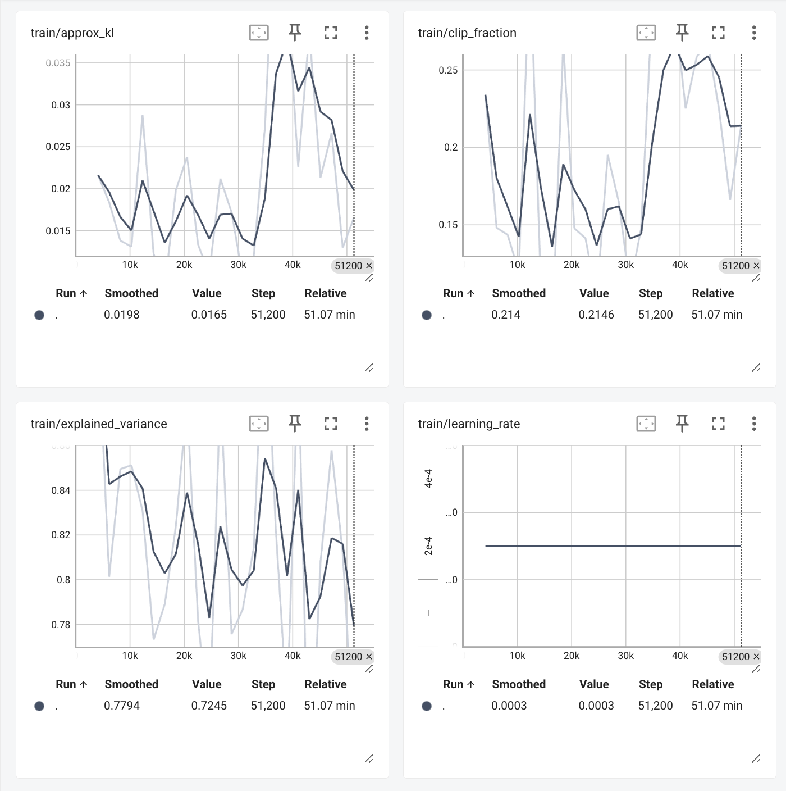

# Super Mario Bros - Reinforcement Learning using PPO 🍄🎮🕹️👾

  

This project showcases the application of Reinforcement Learning (RL) to train an agent to play the classic NES game, Super Mario Bros. Leveraging the [`gym-super-mario-bros`](https://pypi.org/project/gym-super-mario-bros/) environment and the Proximal Policy Optimization (PPO) algorithm from `stable-baselines3`, the agent learns to navigate the game's challenges effectively.

## Key Components

- **Reinforcement Learning (RL):** Utilized to enable the agent to learn optimal actions through trial and error, maximizing cumulative rewards.

- **Simplified Controls with SIMPLE_MOVEMENT:** Employed the `SIMPLE_MOVEMENT` action set to reduce the complexity of possible actions, focusing the agent's learning process on essential movements.

- **Preprocessing Techniques:**
  - *Grayscale Conversion:* Reduced the observation space by converting frames to grayscale, simplifying the input for the learning algorithm.
  - *Frame Stacking:* Combined consecutive frames to provide temporal context, aiding the agent in understanding motion dynamics.

- **Environment Setup:**
  - Integrated the `gym-super-mario-bros` library with [`gym`](https://www.gymlibrary.dev/index.html) by OpenAI (not [`gymnasium`](https://gymnasium.farama.org/) by Farama Foundation ) to create the Super Mario Bros environment.
  - Wrapped the environment with `DummyVecEnv` to facilitate vectorized operations, enhancing training efficiency.

- **Model Training:**
  - Implemented the PPO algorithm with a Convolutional Neural Network (CnnPolicy) from `stable-baselines3`.
  - Set a learning rate of `2.5e-4` and trained the model over `150,000` timesteps.
  - Monitored training progress and performance metrics using `TensorBoard` for real-time visualization.
 
  

- **Model Evaluation:**
  - Assessed the trained agent's performance using the `evaluate_policy` function, ensuring the agent meets desired proficiency levels.
 
## Why PPO (Policy-Based Method) over DQN (Value-Based Method)?

* Action Space Handling - DQN works best in discrete action spaces, but Super Mario has complex movement combinations (jumping + running, etc.), making PPO a better choice.
* Sample Efficiency - DQN is not as efficient as PPO in handling large amounts of data from the environment.
* Frame Stacking & Temporal Dependency – Mario requires decision-making based on past frames. PPO, being a policy-gradient method, naturally considers sequential dependencies, whereas DQN treats each frame independently.
* Continuous vs. Discrete - PPO can handle both continuous and discrete action spaces, while DQN is limited to discrete ones.

## References

- [Stable-Baselines3 PPO Documentation](https://stable-baselines3.readthedocs.io/en/master/modules/ppo.html)
- [gym-super-mario-bros GitHub Repository](https://github.com/Kautenja/gym-super-mario-bros)
- [Proximal Policy Optimization Paper](https://arxiv.org/abs/1707.06347)
